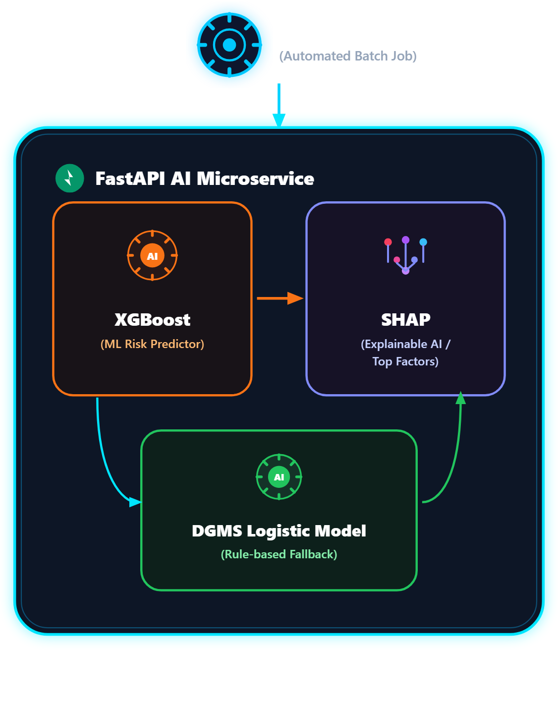

# ⛏️ CoalGuard / Khanan-Net (खनन-नेट)
### AI-Powered Smart Governance, Risk Prediction & Statutory Compliance Monitoring System for Coal Mines

[](https://sih.gov.in/)
[](https://sih.gov.in/)
[](https://react.dev/)
[](https://vitejs.dev/)
[](https://fastapi.tiangolo.com/)
[](https://supabase.com/)
[](https://ultralytics.com/)
[](https://shap.readthedocs.io/)

**Target Organization:** Ministry of Coal / Coal India Limited (CIL) & Directorate General of Mines Safety (DGMS)  
**Problem Statement ID:** SIH26024  

---

## 📑 Table of Contents
- [Executive Summary](#-executive-summary)
- [Key Features](#-key-features)
- [System Architecture](#-system-architecture)
- [10-Model AI/ML Engine](#-10-model-aiml-engine)
- [Demo Credentials](#-demo-credentials-instant-login)
- [Tech Stack](#-tech-stack)
- [Repository Structure](#-repository-structure)
- [Quick Start Guide](#-quick-start-guide)
- [Environment Variables](#-environment-variables)
- [Statutory Compliance & Legal Adherence](#-statutory-compliance--legal-adherence)
- [Documentation & Deep-Dive](#-documentation--deep-dive)

---

## 🎯 Executive Summary

Indian coal mining operations span hundreds of underground and open-cast collieries governed by stringent statutory regulations under the **Mines Act 1952** and the **Coal Mines Regulations (CMR 2017)** overseen by the **Directorate General of Mines Safety (DGMS)**.

Historically, mining safety governance has suffered from four systemic failure points:
1. **Paper-Bound Statutory Registers:** Thousands of physical Form IV/V reports and daily logbooks are vulnerable to tampering, loss, and post-incident backdating.
2. **Lack of Underground Connectivity:** Deep coal seams lack cellular networks, preventing field inspectors and sirdars from logging hazards in real time.
3. **"Black-Box" Safety Decisions:** Basic ML models cannot explain *why* a particular pit or seam is dangerous, causing safety officers to mistrust AI recommendations.
4. **Catastrophic Inrush & Gas Delays:** Underground water inrushes from pressurized aquifers can flood a mine in 15 minutes, but laboratory hydrochemical titration takes 24–48 hours.

### 💡 The Solution: CoalGuard (Khanan-Net)
**CoalGuard** is an industrial-grade, offline-first digital governance and predictive safety platform. It pairs modern web engineering (**React 19, Vite, PWA, Supabase Realtime**) with an advanced **10-Model AI/ML Microservice** (Computer Vision, OCR, Zero-Shot NLP, Speech Recognition, Multilingual Translation, CLSSA-XGBoost, and TreeSHAP Explainable AI) to automate statutory compliance, safeguard workers, and predict geological hazards before loss of life occurs.

---

## ✨ Key Features

- 🛰️ **Geospatial Risk & Colliery Heatmaps:** Real-time interactive GIS mapping of coal fields across subsidiaries (ECL, BCCL, CCL, WCL, SECL, MCL, NCL) with dynamic risk indexing.
- 📱 **Offline-First PWA Architecture:** Works deep inside underground coal faces without cellular network using `IndexedDB` & Service Workers. Automatically synchronizes queue upon reaching the pit surface.
- 🦺 **Automated PPE & Safety Gear Detection:** YOLOv8 vision pipeline monitoring CCTV / site photos for helmets, safety vests, and footwear compliance with automated violation ticket generation.
- 🌊 **CLSSA-XGBoost Water Inrush & Aquifer Prediction:** Classifies water source (Goaf Water vs. Surface Aquifer vs. Deep Limestone) in seconds using ionic hydrochemical ratios ($Na^+, K^+, Ca^{2+}, Mg^{2+}, Cl^-, SO_4^{2-}, HCO_3^-$).
- 🔍 **Explainable AI (TreeSHAP):** Every AI risk score provides interactive SHAP waterfall and force plots showing *exactly* which sensor readings or statutory violations drove the risk.
- ⚖️ **DGMS / CMR 2017 Statutory Registers:** Digital Form IV (Accidents), Form V (Dangerous Occurrences), and shift inspection logs with tamper-evident audit trails.
- 🗣️ **Multilingual Voice-to-Text Reporting:** Whisper Large v3 voice recording paired with IndicTrans2 translation supporting 10+ Indian languages (Hindi, Bengali, Odia, etc.) for grassroots workers.
- 🔐 **Role-Based Access Control (RBAC):** Tailored dashboards for Corporate CIL Executives, DGMS Regulators, Colliery Managers, and Field Safety Officers.

---

## 🏗️ System Architecture



```
┌─────────────────────────────────────────────────────────────┐
│                 FIELD WORKERS & INSPECTORS                  │
│    Underground / Surface (Smartphones, Tablets, Rugged)     │
└──────────────────────────────┬──────────────────────────────┘
                               │ Offline PWA (Service Worker)
┌──────────────────────────────▼──────────────────────────────┐
│             CLIENT STORAGE: IndexedDB (`idb`)               │
│  • Offline Hazard Reports       • Voice Audio Recordings    │
│  • GPS Proof-of-Presence        • Device-cached Registers   │
└──────────────────────────────┬──────────────────────────────┘
                               │ Background Sync
┌──────────────────────────────▼──────────────────────────────┐
│                    SUPABASE CLOUD / DB                      │
│  • PostgreSQL Database          • Row-Level Security (RLS)  │
│  • Realtime Subscriptions       • Cryptographic Audit Log   │
└──────────────────────────────┬──────────────────────────────┘
                               │ REST / Async JSON
┌──────────────────────────────▼──────────────────────────────┐
│             FASTAPI AI / ML MICROSERVICE (:8000)            │
│  • YOLOv8 PPE Vision            • CLSSA-XGBoost Inrush      │
│  • TreeSHAP Explainability      • TrOCR & Donut VDU         │
│  • Whisper Large v3             • IndicTrans2 Translation   │
└─────────────────────────────────────────────────────────────┘
```

---

## 🤖 10-Model AI/ML Engine

| # | Model / Architecture | Task / Domain | Function in CoalGuard |
|---|---|---|---|
| **1** | `keremberke/yolov8n-ppe-detection` | Computer Vision (CNN) | Real-time worker PPE compliance (Hardhat, Vest, Boots) |
| **2** | `microsoft/trocr-large-printed` | OCR / Vision Transformer | Digitize legacy paper shift logs & equipment maintenance books |
| **3** | `naver-clova-ix/donut-base` | Visual Document Understanding | Parse complex tabular Form IV/V statutory registers without OCR |
| **4** | `facebook/bart-large-mnli` | Zero-Shot NLI Classification | Auto-categorize unstructured incident reports into DGMS hazard classes |
| **5** | `dslim/bert-base-NER` | Named Entity Recognition (NER) | Extract worker IDs, seam names, machinery tags, and timestamps |
| **6** | `ai4bharat/indictrans2-en-indic` | Multilingual Neural Translation | Translate statutory alerts into 10+ Indian regional languages |
| **7** | `openai/whisper-large-v3` | Automatic Speech Recognition | Hands-free voice hazard reporting for underground field workers |
| **8** | `Pipeline Chaining Engine` | End-to-End Multi-Model Flow | Chains Image $\rightarrow$ YOLOv8 $\rightarrow$ NER $\rightarrow$ Auto-Generated Ticket |
| **9** | `XGBoost + TreeSHAP` | Tabular Risk Classification | Mine-wide hazard score prediction with feature contribution plots |
| **10** | `CLSSA-XGBoost + TreeSHAP` | Hydrochemical Inrush AI | Underground water inrush source classification & aquifer identification |

---

## 🔑 Demo Credentials (Instant Login)

You can log in directly to evaluate different roles and permission levels:

| Role | Email | Password | Access Level |
| :--- | :--- | :--- | :--- |
| **Colliery Manager** | `mine_official@coalguard.demo` | `Demo@2026` | Colliery-level operations, shift registers, Govindpur Colliery |
| **Corporate CIL** | `corporate@coalguard.demo` | `Demo@2026` | Enterprise subsidiary overview, risk matrix, executive reports |
| **DGMS Regulator** | `regulator@coalguard.demo` | `Demo@2026` | Statutory audits, violation notices, compliance enforcement |

*(Note: The system also supports `.com` aliases: `mine_official@coalguard.com`, `corporate@coalguard.com`, `regulator@coalguard.com`)*

---

## 🛠️ Tech Stack

- **Frontend:** React 19, TypeScript, Vite 8, Tailwind CSS v4, Lucide Icons, Framer Motion, Recharts, Leaflet (GIS Maps), Dexie.js / IDB (Offline storage)
- **Backend & Database:** Supabase, PostgreSQL 15, Row-Level Security (RLS), Realtime WebSocket channels, pgcrypto
- **AI / Machine Learning:** FastAPI, Python 3.10+, PyTorch, Ultralytics YOLOv8, XGBoost, SHAP, Hugging Face Transformers, Scikit-Learn
- **DevOps & Standards:** Progressive Web App (PWA), Vercel, Docker

---

## 📁 Repository Structure

```
coal-india-sih/
├── ai-service/                   # FastAPI AI/ML microservice (Port 8000)
│   ├── main.py                   # 10-Model endpoints, inference routes, SHAP logic
│   ├── water_inrush_model.py     # CLSSA-XGBoost hydrochemical model
│   ├── requirements.txt          # Python dependencies
│   ├── water_inrush_model.pkl    # Pre-trained inrush model
│   └── water_inrush_explainer.pkl# Pre-computed TreeSHAP explainer
├── backend/                      # Database scripts, SQL migrations & seed data
│   ├── schema.sql                # Core Supabase PostgreSQL schema
│   ├── ppe_vision_migration.sql  # Camera feeds & PPE violation tables
│   ├── migration_support_tickets.sql # Statutory tickets schema
│   ├── seed_all_demo.js          # Demo accounts and realistic colliery data
│   └── cron/                     # Daily scheduled statutory alert jobs
├── frontend/                     # React 19 + Vite PWA frontend
│   ├── src/
│   │   ├── pages/                # Dashboards (Corporate, Colliery, Regulator, AI Workbench)
│   │   ├── components/           # UI components, GIS Maps, Charts, Camera Monitor
│   │   ├── services/             # Supabase client, offline sync, IndexedDB
│   │   └── locales/              # i18n translations (English, Hindi, Bengali, etc.)
│   └── package.json
├── presentation_assets/          # High-resolution architecture & pitch diagrams
├── test_assets/                  # Sample test images (PPE, statutory circulars)
├── PROJECT_DOCUMENTATION.md      # Full 340+ line comprehensive technical documentation
└── README.md                     # Repository landing page
```

---

## 🚀 Quick Start Guide

### Prerequisites
- **Node.js:** v18.0 or higher
- **Python:** v3.10 or higher
- **Git**

### 1. Clone the Repository
```bash
git clone https://github.com/panjshubham/coal-india-sih.git
cd coal-india-sih
```

### 2. Set Up Frontend
```bash
cd frontend
cp .env.example .env     # Configure your Supabase credentials
npm install
npm run dev
```
The frontend will start at `http://localhost:5173`.

### 3. Set Up AI Microservice
```bash
cd ../ai-service
python -m venv venv

# Windows:
.\venv\Scripts\activate
# Linux / macOS:
source venv/bin/activate

pip install -r requirements.txt
cp .env.example .env     # Configure Hugging Face / Supabase keys
uvicorn main:app --host 127.0.0.1 --port 8000 --reload
```
The AI API Swagger documentation will be available at `http://127.0.0.1:8000/docs`.

---

## 🔐 Environment Variables

### `frontend/.env`
```env
VITE_SUPABASE_URL=https://your-project.supabase.co
VITE_SUPABASE_ANON_KEY=your-anon-key
VITE_AI_SERVICE_URL=http://127.0.0.1:8000
```

### `ai-service/.env`
```env
PORT=8000
HUGGINGFACE_API_KEY=your_huggingface_api_token
SUPABASE_URL=https://your-project.supabase.co
SUPABASE_SERVICE_ROLE_KEY=your_service_role_key
```

---

## 📜 Statutory Compliance & Legal Adherence

CoalGuard was designed strictly in accordance with Indian mining legislation:
1. **Coal Mines Regulations (CMR 2017):**
   - Regulation 70: Daily inspection logs & danger reporting.
   - Regulation 104 & 108: Air measurement & noxious gas registers (CO, $CH_4$, $CO_2$).
   - Regulation 129: Precaution against underground inundation / water inrush.
2. **Mines Act 1952:**
   - Section 23: Compulsory notification of accidents (Form IV-A/B).
3. **DGMS Circulars:**
   - Real-time digital audit trail ensuring compliance records cannot be post-dated or repudiated.

---

## 📖 Documentation & Deep-Dive

For complete mathematical formulations, CLSSA optimization algorithms, SHAP equations, and exhaustive database schemas, refer to:
- 📘 [Full Technical Specification (PROJECT_DOCUMENTATION.md)](./PROJECT_DOCUMENTATION.md)
- 📊 [Executive Pitch Deck Assets](./presentation_assets/)
- 📄 [SIH Submission Summary](./sih_submission_summary.md)

---

**Team Khanan-Net** | Smart India Hackathon 2026 | Ministry of Coal (SIH26024)
