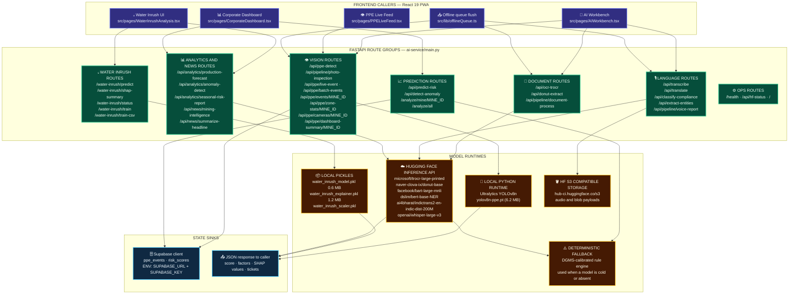
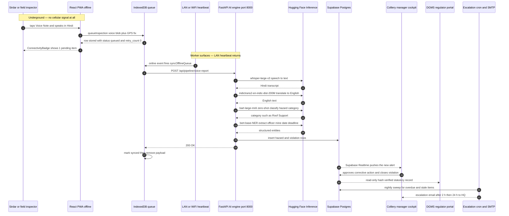
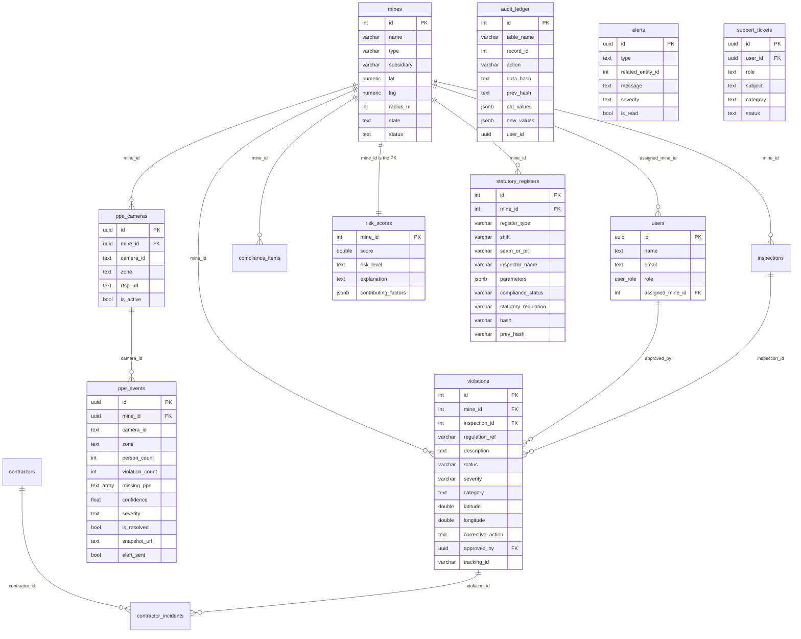
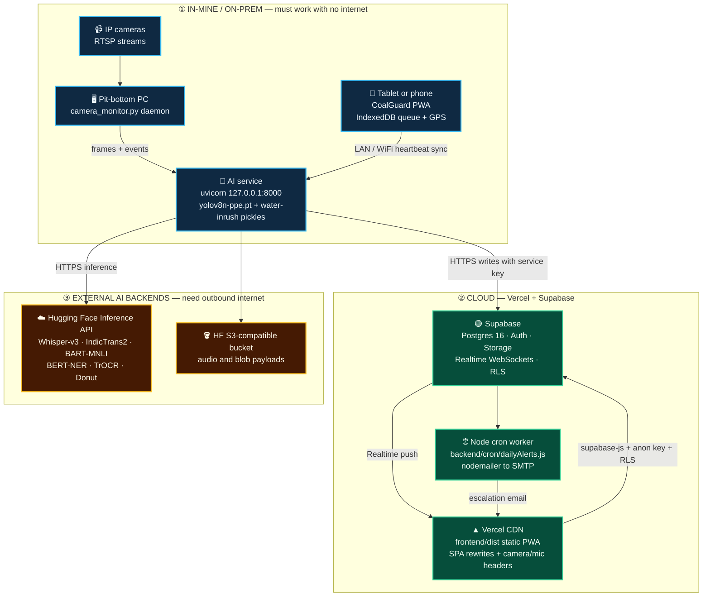

# CoalGuard / Khanan-Net — Solution Architecture Diagram Set

Separate from `system_architecture.mmd` (the hardware/LAN topology). This set answers
**“how do we solve the problem, using what, and what output do we get?”** — mapped to the
files that actually exist in this repo.

Every Mermaid block below was parsed with Mermaid v12, so each one is safe to paste into
<https://mermaid.live> or render in a Markdown preview.

| # | Diagram | Question it answers |
|---|---|---|
| 1 | Master solution architecture (`solution_architecture.mmd`) | Problem → what we use → output |
| 2 | AI engine internals | Which of the 10 models runs behind which route |
| 3 | End-to-end sequence | What physically happens from a sirdar's voice note to a manager alert |
| 4 | Data model (ER) | What is stored where |
| 5 | Real-time PPE vision pipeline | How a CCTV frame becomes a statutory violation |
| 6 | Deployment topology | What runs in the mine vs in the cloud |

---

## Diagram 2 — AI ENGINE INTERNALS (`ai-service/main.py`, FastAPI v4.0.0, 33 routes)

> **Two honest caveats visible in the code:** `ai-service/model.pkl` and `explainer.pkl` are
> absent from this folder (they only exist in the legacy copy `backend/ai-service/`), so the
> XGBoost branch of `/api/predict-risk` never fires and the DGMS-calibrated fallback returns the
> score. And `ai-service/.env` has no `SUPABASE_URL`/`SUPABASE_KEY`, so `/analyze/all` returns a
> hard-coded `"status": "simulated"` payload and the PPE ingestion routes cannot persist.

---

## Diagram 3 — END-TO-END SEQUENCE (offline voice hazard → manager alert)

---

## Diagram 4 — DATA MODEL (what is stored where)

> **Real schema risk worth fixing:** `ppe_cameras.mine_id` / `ppe_events.mine_id` are declared
> `UUID REFERENCES public.mines(id)`, but `mines.id` is an **integer** (per the live DB schema).
> That insert path fails unless the PPE tables are cast to `int` or the module is fed synthetic
> UUID mine ids.

---

## Diagram 5 — REAL-TIME PPE VISION PIPELINE (frame → statutory violation)

```mermaid
flowchart LR
  subgraph EDGE["① IN-MINE EDGE"]
    direction TB
    CAM["📹 CCTV / RTSP camera<br/>one row per camera in ppe_cameras"]
    MON["🐍 backend/camera_monitor.py<br/>async worker pool, frame sampling"]
    BAT["📦 event batcher<br/>BATCH_SIZE events per request"]
  end

  subgraph ENGI["② AI ENGINE — FastAPI"]
    direction TB
    DET["👁️ POST /api/ppe-detect<br/>YOLOv8n yolov8n-ppe.pt"]
    TRI["🧠 compliance triage<br/>helmet / safety vest / boots<br/>person_count vs violation_count"]
  end

  subgraph STORE["③ PERSISTENCE"]
    direction TB
    BULK["POST /api/ppe/batch-events<br/>insert into ppe_events"]
    LIVE["POST /api/ppe/live-event<br/>single-event fast path"]
    SNAP["🖼️ snapshot upload<br/>Supabase Storage bucket photos"]
  end

  subgraph VIS["④ OUTPUT"]
    direction TB
    ZS["GET /api/ppe/zone-stats/MINE_ID<br/>compliance % per zone, last 24 h"]
    SUM["GET /api/ppe/dashboard-summary/MINE_ID<br/>KPI roll-up for the cockpit"]
    FEED["👁️ PPE Live Feed page<br/>src/pages/PPELiveFeed.tsx"]
    ALC["🚨 AlertBell + alerts table<br/>critical breach escalates to mail"]
    VIO["⛏️ violation ticket<br/>feeds Violations + audit_ledger"]
  end

  CAM --> MON
  MON -->|"JPEG frame, octet-stream"| DET
  DET --> TRI
  TRI -->|"batch"| BAT
  TRI -->|"immediate"| LIVE
  BAT --> BULK
  BULK --> SNAP
  SNAP --> ZS
  BULK --> ZS
  ZS --> SUM
  SUM --> FEED
  BULK --> ALC
  BULK --> VIO
  VIO --> FEED

  classDef edge fill:#0f2942,stroke:#38bdf8,stroke-width:2px,color:#f0f9ff;
  classDef eng fill:#451a03,stroke:#fbbf24,stroke-width:2px,color:#fffbeb;
  classDef st fill:#064e3b,stroke:#34d399,stroke-width:2px,color:#f0fdf4;
  classDef out fill:#312e81,stroke:#818cf8,stroke-width:2px,color:#eef2ff;
  class CAM,MON,BAT edge;
  class DET,TRI eng;
  class BULK,LIVE,SNAP st;
  class ZS,SUM,FEED,ALC,VIO out;
```

> **Production break to note:** `PPELiveFeed.tsx` hard-codes `AI_BASE = 'http://127.0.0.1:8000'`
> and `MINE_ID = '1'`. On the Vercel deployment that points at the *visitor's own machine*, so the
> PPE feed only works in the local LAN demo — it needs `VITE_AI_SERVICE_URL` plus the real mine id
> from the auth context.

---

## Diagram 6 — DEPLOYMENT TOPOLOGY (what runs where)

---

## THE OUTPUT MATRIX — what we get, for whom, under which statute

| Output we deliver | Who receives it | Where it lives in code | Statute / rule it satisfies |
|---|---|---|---|
| GIS risk heatmap + subsidiary roll-up | CIL / subsidiary HQ (corporate) | `pages/CorporateDashboard.tsx`, `pages/GeospatialMap.tsx` | Mines Act 1952 §18 management oversight |
| Live hazard, methane, manpower cockpit | Colliery manager (`mine_official`) | `pages/CollieryManagerDashboard.tsx` | CMR 2017 Reg. 70 daily inspection and danger reporting |
| Risk score 0–100 + SHAP factor breakdown | Safety officer / HQ | `/api/predict-risk`, `components/RiskExplanationModal.tsx` | DGMS predictive vigilance, explainable AI |
| Water-inrush source prediction + TreeSHAP waterfall | Mine geologist / manager | `/water-inrush/predict`, `pages/WaterInrushAnalysis.tsx` | CMR 2017 Reg. 129 inundation precaution |
| Hash-chained statutory shift register (Form IV/V) | DGMS inspector + manager | `pages/StatutoryRegisters.tsx`, `statutory_registers`, `audit_ledger` | CMR 2017 Reg. 104/105/149, tamper-evident record |
| Read-only regulator portal with verified hashes | DGMS (regulator) | `pages/RegulatorDashboard.tsx`, `pages/AuditLog.tsx` | Mines Act 1952 §22/23, DGMS circulars |
| PPE violation tickets + zone compliance % | Manager, safety officer, contractor | `pages/PPELiveFeed.tsx`, `ppe_events`, `components/AlertBell.tsx` | PPE rules, CMR 2017 |
| Escalation emails (2 h manager → 24 h HQ) | Manager, then subsidiary HQ | `backend/cron/dailyAlerts.js`, `alerts` table | Time-bound statutory escalation |
| Blast zone lockdown + geofenced evacuation | All workers in the zone | `pages/BlastZoneLockdown.tsx`, `mines.radius_m` | Blasting precautions and evacuation drill |
| 1-click Form V PDF / XLSX export | DGMS, auditors | jsPDF + autotable, `xlsx` | Statutory Form V submission |
| Public transparency page | Citizens, RTI applicants | `pages/PublicTracking.tsx` | Public accountability |
| Grievance tickets with resolution trail | Worker → admin → regulator | `pages/HelpSupport.tsx`, `support_tickets` | Grievance redressal |
| Vernacular voice reporting (Hindi, Odia, Bengali) | Underground worker (cannot type) | `lib/offlineQueue.ts`, `/api/pipeline/voice-report`, `src/i18n.ts` | Inclusive compliance reporting |

---

### How to render

- **Individual diagram:** copy any fenced block into <https://mermaid.live>.
- **Whole file:** open in VS Code with a Mermaid Markdown preview extension, or paste into GitHub
  (GitHub renders `mermaid` fenced blocks natively).
- **Master diagram:** `presentation_assets/solution_architecture.mmd` (pure Mermaid, no fences) —
  drag it straight into mermaid.live.

